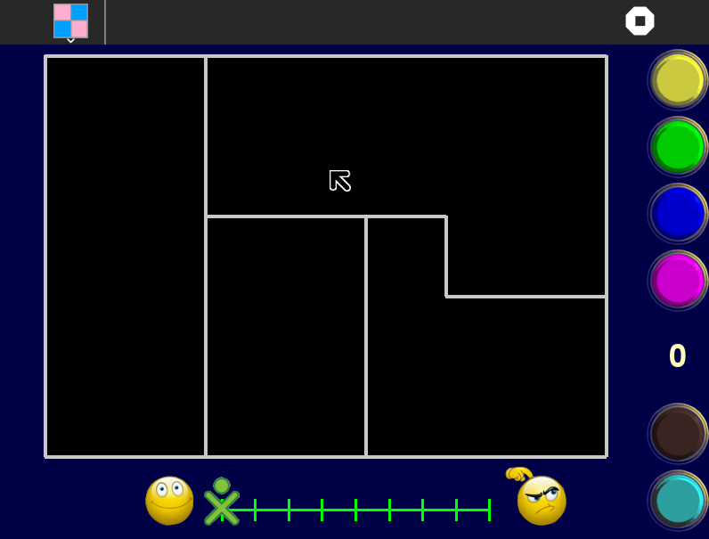

Appel-Haken activity 
===============

Appel-Haken activity can be used to learn about colors and differentiate between two different colors. Your task is to colour in the map so that no two bordering countries have the same colour.

How to use?
===============

Few Keys with their use:
* o = right click = reset
* square or spacebar = new round
* tick or enter = change level
* the number keys (1 to 4) will choose a colour

Appel-Haken activity is not a part of Sugar Desktop but can be added. Refer to the following links-

* [How to Get Sugar on sugarlabs.org](https://sugarlabs.org/), 
* [How to use Sugar](https://help.sugarlabs.org/), and;
* [How to download Appel-Haken](https://activities.sugarlabs.org/en-US/sugar/addon/4414) 

You're looking at a map with straight borders. The maps are generated randomly but I know from Appel & Haken's work that four colours will always be sufficient. The number of countries can be varied. Your score depends on which level you have selected.

How to upgrade?
===============
On Sugar Desktop systems;

* [Use My Settings,](https://help.sugarlabs.org/my_settings.html) [Software Update](https://help.sugarlabs.org/my_settings.html#software-update) 
* [Use Browse to open ](https://activities.sugarlabs.org/)activities.sugarlabs.org Search for Appel-Haken, then download.

You can easily tell which version you have by pressing the v key - if this gives no response, then you have an older version.
